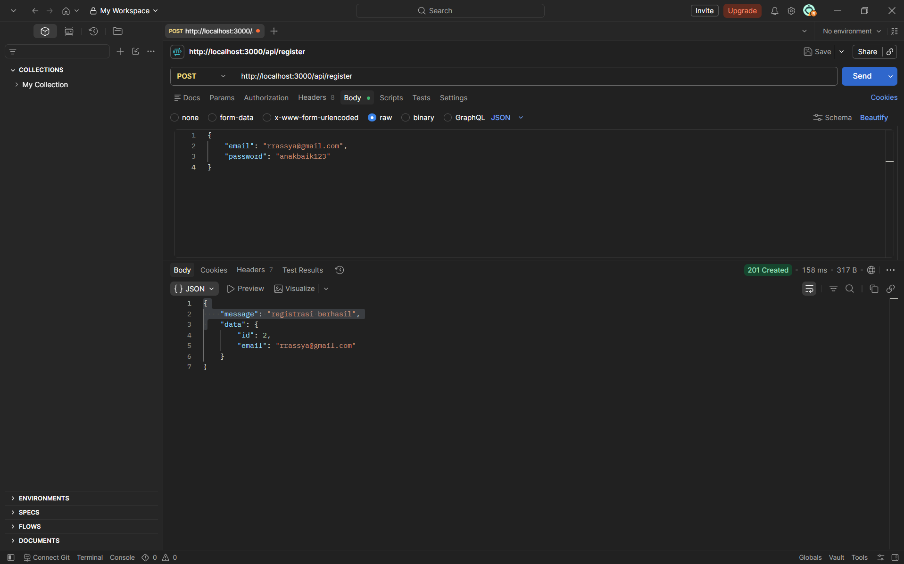
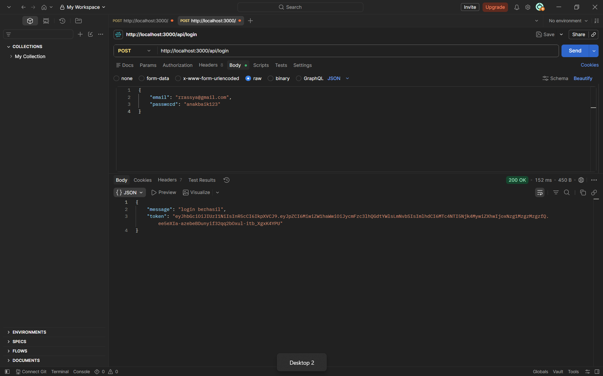
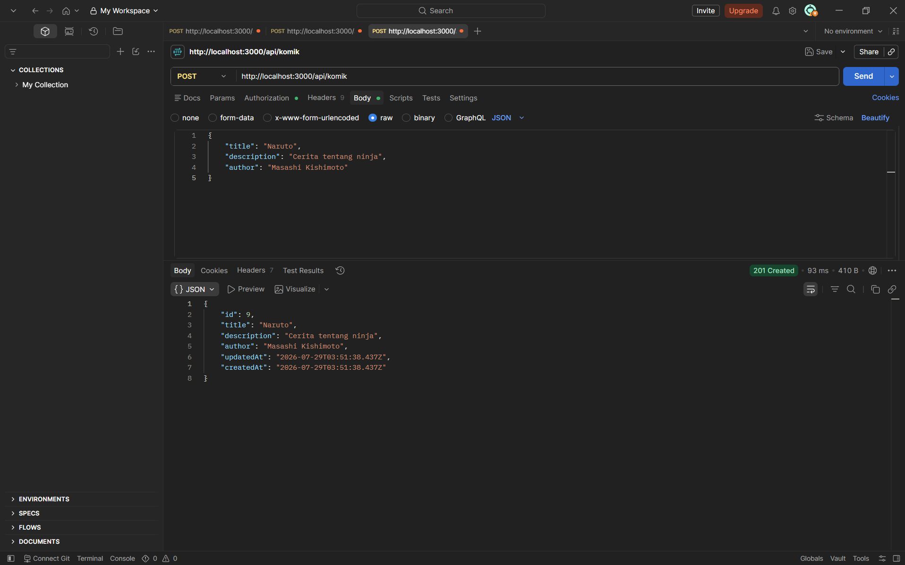
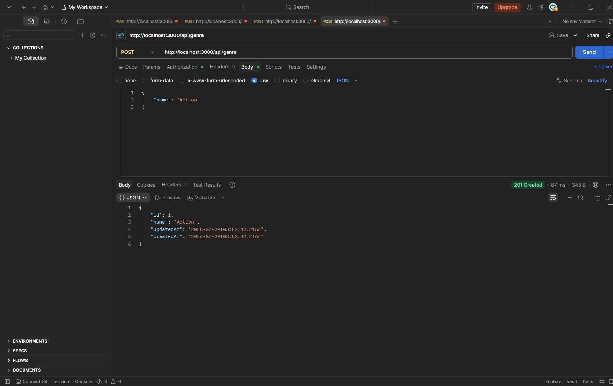
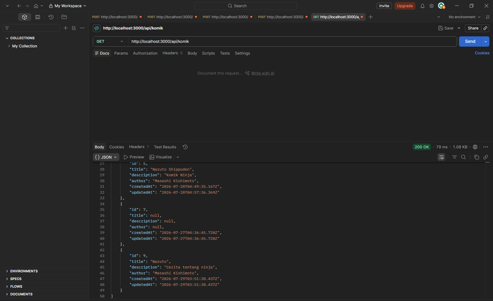
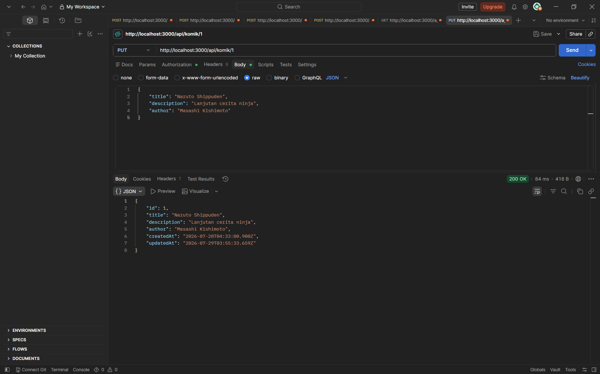
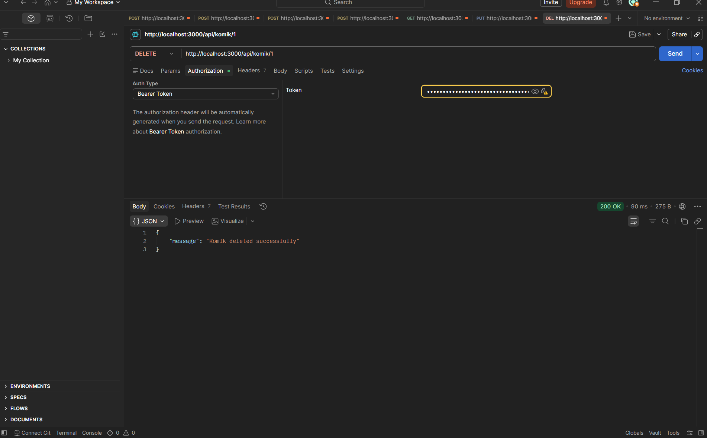
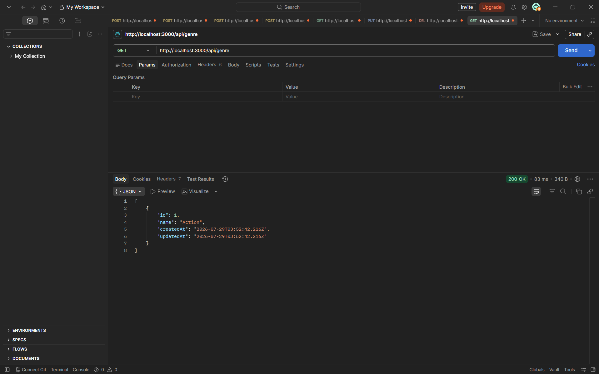
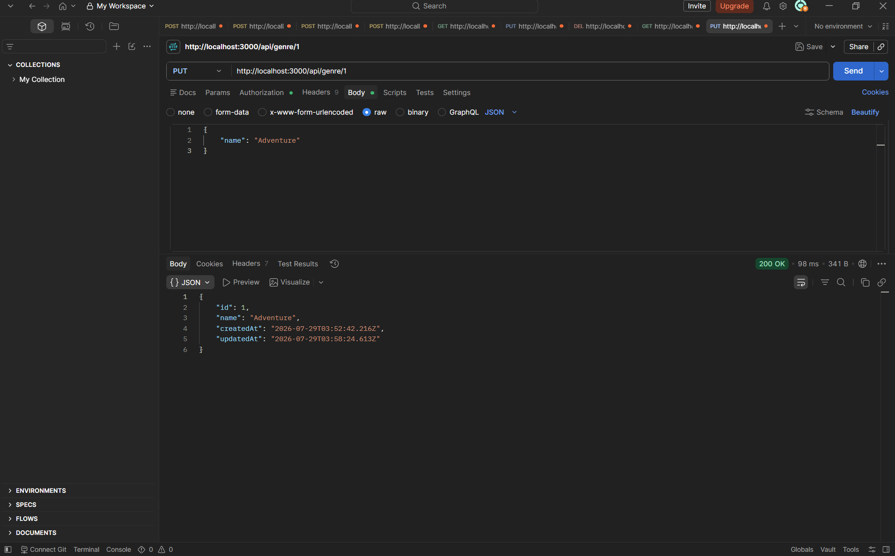
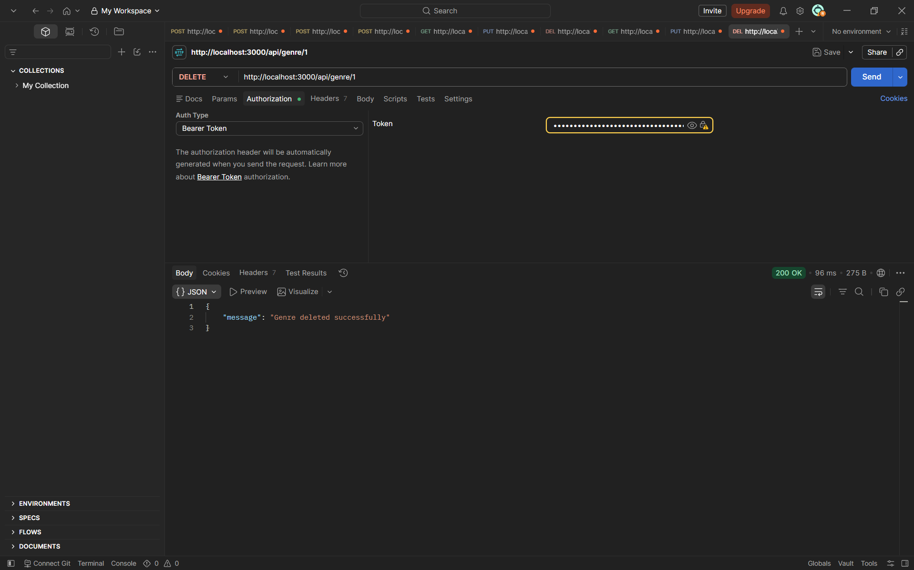

# DOKUMENTASI API KOMIK & GENRE

**Express.js + Sequelize + PostgreSQL + JWT Authentication**

---

| | |
|---|---|
| **Mata Kuliah** | Pengembangan Web Servis |
| **Pertemuan** | 8 |
| **Nama** | Rassya |
| **NIM** | 20250140157 |


---

## DAFTAR ISI

1. [Deskripsi Project](#1-deskripsi-project)
2. [Tech Stack](#2-tech-stack)
3. [Cara Membuat Project Dari Nol](#3-cara-membuat-project-dari-nol)
4. [Struktur Folder](#4-struktur-folder)
5. [Konfigurasi .env](#5-konfigurasi-env)
6. [Database Models](#6-database-models)
7. [Cara Install & Menjalankan Project](#7-cara-install--menjalankan-project)
8. [Daftar Semua Endpoint API](#8-daftar-semua-endpoint-api)
9. [Panduan Postman Lengkap (10 Step + Screenshot)](#9-panduan-postman-lengkap-10-step--screenshot)
10. [Cara Set Token (Bearer Token) di Postman](#10-cara-set-token-bearer-token-di-postman)
11. [Error Handling](#11-error-handling)
12. [Penutup](#12-penutup)

---

## 1. DESKRIPSI PROJECT

Project ini adalah sebuah **RESTful API (Application Programming Interface)** yang dibangun menggunakan **Node.js** dengan framework **Express.js**. API ini berfungsi untuk mengelola data **Komik** dan **Genre** secara digital.

### Fitur Utama:
- **Autentikasi User** — Setiap pengguna harus mendaftar (register) dan login untuk mendapatkan token akses
- **CRUD Komik** — Create, Read, Update, Delete data komik
- **CRUD Genre** — Create, Read, Update, Delete data genre
- **Sistem Keamanan** — Password di-hash menggunakan bcrypt, akses dilindungi dengan JWT (JSON Web Token)

### Alur Kerja API:
1. User melakukan **Register** (mendaftar dengan email dan password)
2. User melakukan **Login** (masuk dengan email dan password)
3. Server memberikan **Token JWT** jika login berhasil
4. Token JWT digunakan untuk mengakses endpoint-endpoint yang **dilindungi** (POST, PUT, DELETE)
5. Endpoint **GET** bisa diakses oleh siapa saja tanpa token

### Teknologi Yang Digunakan:
- **Node.js** sebagai runtime JavaScript
- **Express.js** sebagai framework web
- **Sequelize** sebagai ORM (Object Relational Mapping) untuk database
- **PostgreSQL** sebagai database
- **JWT (jsonwebtoken)** untuk autentikasi berbasis token
- **bcrypt** untuk mengamankan password

---

## 2. TECH STACK

Berikut adalah daftar teknologi dan library yang digunakan dalam project ini beserta versi dan fungsinya:

| No | Teknologi | Versi | Fungsi |
|----|-----------|-------|--------|
| 1 | **Node.js** | - | Runtime JavaScript untuk menjalankan kode di server |
| 2 | **Express.js** | ^5.2.1 | Framework web untuk membuat REST API |
| 3 | **Sequelize** | ^6.37.8 | ORM untuk menghubungkan Node.js dengan database PostgreSQL |
| 4 | **Sequelize CLI** | ^6.6.5 | Tools baris perintah untuk Sequelize (inisialisasi, migrasi) |
| 5 | **PostgreSQL** | - | Database relasional untuk menyimpan data |
| 6 | **pg** | ^8.22.0 | Driver PostgreSQL untuk Node.js |
| 7 | **bcrypt** | ^6.0.0 | Library untuk meng-hash password |
| 8 | **jsonwebtoken** | ^9.0.3 | Library untuk membuat dan memverifikasi token JWT |
| 9 | **dotenv** | ^17.4.2 | Library untuk membaca file konfigurasi .env |
| 10 | **nodemon** | ^3.1.14 | Tools untuk auto-restart server saat ada perubahan kode |

---

## 3. CARA MEMBUAT PROJECT DARI NOL

Bagian ini menjelaskan langkah-langkah membuat project ini dari awal.

### Langkah 1: Buat Folder Project
Buka terminal/CMD, lalu buat folder baru dan masuk ke dalamnya:
```bash
mkdir 157_APIKomik
cd 157_APIKomik
```

### Langkah 2: Inisialisasi Node.js
Jalankan perintah berikut untuk membuat file `package.json`:
```bash
npm init -y
```
Parameter `-y` artinya menggunakan semua nilai default (tanpa ditanya-tanya).

### Langkah 3: Install Semua Dependencies
Jalankan perintah berikut untuk menginstall semua library yang dibutuhkan:
```bash
npm install express pg sequelize sequelize-cli dotenv nodemon jsonwebtoken bcrypt
```
Perintah ini akan mendownload dan menginstall 8 library sekaligus ke folder `node_modules/`.

### Langkah 4: Inisialisasi Sequelize
Jalankan perintah berikut untuk membuat struktur folder Sequelize secara otomatis:
```bash
npx sequelize init
```
Setelah menjalankan perintah ini, Sequelize akan otomatis membuat folder dan file berikut:
```
📁 config/
   └── config.js       → File konfigurasi database
📁 models/
   └── index.js        → File utama models (inisialisasi Sequelize)
📁 migrations/         → Folder untuk file migrasi database
📁 seeders/            → Folder untuk file seeding data
```
File-file ini nantinya akan diedit sesuai kebutuhan project.

### Langkah 5: Buat Folder Tambahan
Buat folder yang belum tergenerate oleh Sequelize:
```bash
mkdir controller middleware routes ss
```

### Langkah 6: Buat File-File Project
Buat file-file utama yang dibutuhkan:
```bash
type nul > index.js
type nul > .env
type nul > config/db.js
type nul > controller/userController.js
type nul > controller/komikController.js
type nul > controller/genreController.js
type nul > middleware/authMiddleware.js
type nul > routes/api.js
type nul > models/user.js
type nul > models/komik.js
type nul > models/genre.js
```

### Langkah 7: Edit package.json (Tambah Script Start)
Buka `package.json`, cari bagian `"scripts"`, lalu ubah menjadi:
```json
"scripts": {
    "test": "echo \"Error: no test specified\" && exit 1",
    "start": "nodemon index.js"
}
```
Dengan script ini, server bisa dijalankan cukup dengan perintah `npm start`.

### Langkah 8: Isi File-File Project
Selanjutnya, isi setiap file dengan kode programnya (lihat source code yang sudah ada di project ini).

### Langkah 9: Setup .env
Buat file `.env` dan isi dengan konfigurasi database (lihat bagian 5).

### Langkah 10: Jalankan Server
```bash
npm start
```

---

## 4. STRUKTUR FOLDER

Berikut adalah struktur folder dan file dalam project ini beserta penjelasan fungsi masing-masing:

```
D:\SEMESTER_ANTARA\Pengembangan_Web_Servis\Praktikum\Pertemuan_8\157_APIKomik\
│
├── 📁 config/
│   ├── config.js          → Konfigurasi koneksi database (membaca dari .env)
│   └── db.js              → Fungsi untuk menghubungkan dan sync database
│
├── 📁 controller/
│   ├── userController.js   → Logika bisnis untuk Register & Login
│   ├── komikController.js  → Logika bisnis untuk CRUD Komik
│   └── genreController.js  → Logika bisnis untuk CRUD Genre
│
├── 📁 middleware/
│   └── authMiddleware.js   → Middleware untuk verifikasi token JWT
│
├── 📁 models/
│   ├── index.js           → Inisialisasi Sequelize & load semua model
│   ├── user.js            → Model User (id, email, password)
│   ├── komik.js           → Model Komik (id, title, description, author)
│   └── genre.js           → Model Genre (id, name)
│
├── 📁 routes/
│   └── api.js             → Definisi semua endpoint API
│
├── 📁 migrations/          → Folder untuk migrasi database (kosong)
├── 📁 seeders/             → Folder untuk seeding data (kosong)
├── 📁 ss/                  → Folder screenshot hasil testing Postman
│
├── 📁 node_modules/        → Folder dependencies (hasil npm install)
│
├── .env                    → File konfigurasi environment variables
├── .sequelizerc            → Konfigurasi path untuk Sequelize CLI
├── index.js                → Entry point / file utama server
├── package.json            → Daftar dependencies & script
└── package-lock.json       → Lock file untuk dependencies
```

### Penjelasan Setiap File Penting:

| Nama File | Path Lengkap | Fungsi |
|-----------|-------------|--------|
| `index.js` | `/index.js` | Entry point server. Inisialisasi Express, middleware, dan routing. Server berjalan di port 3000 |
| `.env` | `/.env` | Menyimpan konfigurasi rahasia (database credentials, JWT secret) |
| `config.js` | `/config/config.js` | Membaca file `.env` dan mengekspor konfigurasi untuk Sequelize |
| `db.js` | `/config/db.js` | Fungsi untuk mengkoneksikan dan menyinkronkan database |
| `index.js` (models) | `/models/index.js` | Menginisialisasi Sequelize, membaca semua file model, dan mengekspornya |
| `user.js` | `/models/user.js` | Mendefinisikan struktur tabel User (id, email, password) |
| `komik.js` | `/models/komik.js` | Mendefinisikan struktur tabel Komik (id, title, description, author) |
| `genre.js` | `/models/genre.js` | Mendefinisikan struktur tabel Genre (id, name) |
| `userController.js` | `/controller/userController.js` | Berisi fungsi register (createUser) dan login |
| `komikController.js` | `/controller/komikController.js` | Berisi fungsi CRUD komik (getAll, getById, create, update, delete) |
| `genreController.js` | `/controller/genreController.js` | Berisi fungsi CRUD genre (getAll, getById, create, update, delete) |
| `authMiddleware.js` | `/middleware/authMiddleware.js` | Memeriksa dan memverifikasi token JWT dari header request |
| `api.js` | `/routes/api.js` | Mendefinisikan semua route/endpoint API |

---

## 5. KONFIGURASI .env

File `.env` adalah file konfigurasi yang menyimpan data-data penting dan rahasia. File ini tidak boleh di-upload ke GitHub (sudah di-ignore di `.gitignore`).

### Isi File .env:
```
DB_USER=postgres
DB_PASS=rassya100407
DB_DATABASE=perpustakaan
DB_HOST=127.0.0.1
DB_PORT=5432
DB_DIALECT=postgres

JWT_SECRET=mySuperSecretkey123
JWT_EXPIRES_IN=1d
```

### Penjelasan Setiap Variable:

#### Bagian Database:

| Variable | Contoh Nilai | Penjelasan |
|----------|-------------|------------|
| **DB_USER** | `postgres` | Username untuk masuk ke PostgreSQL. Secara default adalah `postgres` |
| **DB_PASS** | `passwordanda` | Password PostgreSQL yang dibuat saat proses instalasi PostgreSQL |
| **DB_DATABASE** | `perpustakaan` | Nama database yang akan digunakan. Harus dibuat terlebih dahulu di pgAdmin |
| **DB_HOST** | `127.0.0.1` | Alamat/server tempat database berjalan. `127.0.0.1` berarti di komputer lokal (localhost) |
| **DB_PORT** | `5432` | Port yang digunakan PostgreSQL. Default PostgreSQL adalah `5432` |
| **DB_DIALECT** | `postgres` | Jenis database yang digunakan. Karena pakai PostgreSQL, isinya `postgres` |

#### Bagian JWT:

| Variable | Contoh Nilai | Penjelasan |
|----------|-------------|------------|
| **JWT_SECRET** | `mySuperSecretkey123` | Kunci rahasia untuk menandatangani token JWT. Bisa diisi dengan teks apa saja, semakin acak semakin aman |
| **JWT_EXPIRES_IN** | `1d` | Masa berlaku token. Format: `1d` = 1 hari, `1h` = 1 jam, `7d` = 7 hari, `30m` = 30 menit |

### Cara Mengubah Konfigurasi:
Jika password PostgreSQL kamu berbeda, tinggal ganti nilai `DB_PASS` dengan password kamu. Contoh:
```
DB_PASS=passwordSaya123
```

---

## 6. DATABASE MODELS

Model adalah representasi tabel di database dalam bentuk kode JavaScript (Sequelize). Berikut adalah struktur tabel-tabel yang ada di project ini:

### 6.1 Tabel User

Tabel ini digunakan untuk menyimpan data user yang melakukan registrasi.

| Kolom | Tipe Data | Constraint | Keterangan |
|-------|-----------|------------|------------|
| **id** | `INTEGER` | `PRIMARY KEY`, `AUTO INCREMENT` | ID unik untuk setiap user. Bertambah otomatis |
| **email** | `STRING` | `NOT NULL`, `UNIQUE` | Alamat email user. Tidak boleh kosong dan harus unik |
| **password** | `STRING` | `NOT NULL` | Password user yang sudah di-hash menggunakan bcrypt. Tidak boleh kosong |

**Contoh data di tabel User:**
| id | email | password |
|----|-------|----------|
| 1 | rrassya@gmail.com | $2b$10$h9kL... (hash) |

### 6.2 Tabel Komik

Tabel ini digunakan untuk menyimpan data komik.

| Kolom | Tipe Data | Constraint | Keterangan |
|-------|-----------|------------|------------|
| **id** | `INTEGER` | `PRIMARY KEY`, `AUTO INCREMENT` | ID unik untuk setiap komik. Bertambah otomatis |
| **title** | `STRING` | - | Judul komik |
| **description** | `STRING` | - | Deskripsi atau sinopsis komik |
| **author** | `STRING` | - | Nama penulis / pengarang komik |

**Contoh data di tabel Komik:**
| id | title | description | author |
|----|-------|-------------|--------|
| 1 | Naruto | Cerita tentang ninja | Masashi Kishimoto |

### 6.3 Tabel Genre

Tabel ini digunakan untuk menyimpan data genre.

| Kolom | Tipe Data | Constraint | Keterangan |
|-------|-----------|------------|------------|
| **id** | `INTEGER` | `PRIMARY KEY`, `AUTO INCREMENT` | ID unik untuk setiap genre. Bertambah otomatis |
| **name** | `STRING` | `NOT NULL` | Nama genre. Tidak boleh kosong |

**Contoh data di tabel Genre:**
| id | name |
|----|------|
| 1 | Action |

### 6.4 Relasi Antar Tabel

Pada project ini, **tidak ada relasi** antar tabel. Setiap tabel berdiri sendiri (standalone). Tabel `User`, `Komik`, dan `Genre` tidak saling terhubung.

---

## 7. CARA INSTALL & MENJALANKAN PROJECT

### 7.1 Prasyarat

Sebelum menjalankan project ini, pastikan komputer kamu sudah terinstall:

1. **Node.js** (minimal versi 16)
   - Download: https://nodejs.org/
   - Cek instalasi: `node -v`
   
2. **PostgreSQL** (minimal versi 12)
   - Download: https://www.postgresql.org/download/
   - Cek instalasi: `psql --version`
   
3. **Postman**
   - Download: https://www.postman.com/downloads/
   - Untuk testing API

### 7.2 Setup Database PostgreSQL

**Langkah 1: Buka pgAdmin 4**
- Cari "pgAdmin 4" di Start Menu, lalu buka
- Masukkan password (yang dibuat saat install PostgreSQL)

**Langkah 2: Buat Database Baru**
- Di panel kiri, klik kanan pada **Databases**
- Pilih **Create** → **Database**
- Isi **Database name** dengan: `perpustakaan`
- Klik **Save**

**Langkah 3: Catat Kredensial**
Pastikan kamu tahu:
- Username (default: `postgres`)
- Password (yang kamu isi saat install PostgreSQL)
- Port (default: `5432`)

### 7.3 Clone atau Download Project

**Opsi A — Clone dari Git:**
```bash
git clone https://github.com/username/157_APIKomik.git
cd 157_APIKomik
```

**Opsi B — Download Manual:**
- Download ZIP dari repository
- Ekstrak ke folder yang diinginkan
- Buka folder di terminal

### 7.4 Install Dependencies

Buka terminal di folder project, lalu jalankan:
```bash
npm install
```
Tunggu sampai selesai. Perintah ini akan menginstall semua library yang terdaftar di `package.json`.

### 7.5 Konfigurasi .env

Buka file `.env` dan sesuaikan dengan kredensial PostgreSQL kamu:
```
DB_USER=postgres
DB_PASS=password_kamu
DB_DATABASE=perpustakaan
DB_HOST=127.0.0.1
DB_PORT=5432
DB_DIALECT=postgres

JWT_SECRET=mySuperSecretkey123
JWT_EXPIRES_IN=1d
```
**⚠️ PENTING:** Ganti `DB_PASS` dengan password PostgreSQL kamu yang asli.

### 7.6 Jalankan Server

```bash
npm start
```

### 7.7 Cek Output Server

Jika berhasil, akan tampil seperti ini:
```
[nodemon] starting `node index.js`
Server is running on http://localhost:3000
Database connected successfully
Database synchronized
```

Arti dari output tersebut:
| Output | Arti |
|--------|------|
| `Server is running on http://localhost:3000` | Server berhasil berjalan dan siap menerima request di port 3000 |
| `Database connected successfully` | Koneksi ke PostgreSQL berhasil |
| `Database synchronized` | Sequelize berhasil membuat/menyesuaikan tabel-tabel di database |

### 7.8 Verifikasi Tabel di Database

Untuk memastikan tabel sudah terbuat:
1. Buka **pgAdmin 4**
2. Buka: **Servers** → **PostgreSQL** → **Databases** → **perpustakaan** → **Schemas** → **public** → **Tables**
3. Akan terlihat 3 tabel baru: `Users`, `Komiks`, `Genres`
4. Klik kanan salah satu tabel → **View/Edit Data** → **All Rows** untuk melihat isinya

### 7.9 Menghentikan Server

Untuk menghentikan server, tekan:
```bash
Ctrl + C
```

---

## 8. DAFTAR SEMUA ENDPOINT API

### 8.1 Endpoint Autentikasi (Public — Tanpa Token)

| Method | Endpoint | Deskripsi | Request Body | Response Berhasil |
|--------|----------|-----------|--------------|-------------------|
| **POST** | `/api/register` | Mendaftarkan user baru | `{ "email": "...", "password": "..." }` | **201** - `{ "message": "registrasi berhasil", "data": {...} }` |
| **POST** | `/api/login` | Login dan mendapatkan token JWT | `{ "email": "...", "password": "..." }` | **200** - `{ "message": "login berhasil", "token": "eyJ..." }` |

### 8.2 Endpoint Komik (Public — Tanpa Token)

| Method | Endpoint | Deskripsi |
|--------|----------|-----------|
| **GET** | `/api/komik` | Mengambil semua data komik |
| **GET** | `/api/komik/:id` | Mengambil satu komik berdasarkan ID |

### 8.3 Endpoint Komik (Protected — Wajib Token)

| Method | Endpoint | Deskripsi | Request Body |
|--------|----------|-----------|--------------|
| **POST** | `/api/komik` | Menambah komik baru | `{ "title": "...", "description": "...", "author": "..." }` |
| **PUT** | `/api/komik/:id` | Mengupdate data komik | `{ "title": "...", "description": "...", "author": "..." }` |
| **DELETE** | `/api/komik/:id` | Menghapus data komik | - |

### 8.4 Endpoint Genre (Public — Tanpa Token)

| Method | Endpoint | Deskripsi |
|--------|----------|-----------|
| **GET** | `/api/genre` | Mengambil semua data genre |
| **GET** | `/api/genre/:id` | Mengambil satu genre berdasarkan ID |

### 8.5 Endpoint Genre (Protected — Wajib Token)

| Method | Endpoint | Deskripsi | Request Body |
|--------|----------|-----------|--------------|
| **POST** | `/api/genre` | Menambah genre baru | `{ "name": "..." }` |
| **PUT** | `/api/genre/:id` | Mengupdate nama genre | `{ "name": "..." }` |
| **DELETE** | `/api/genre/:id` | Menghapus data genre | - |

### 8.6 Ringkasan Semua Endpoint

| No | Method | Endpoint | Auth | Deskripsi |
|----|--------|----------|------|-----------|
| 1 | POST | `/api/register` | ❌ | Registrasi user baru |
| 2 | POST | `/api/login` | ❌ | Login dan mendapat token |
| 3 | GET | `/api/komik` | ❌ | Melihat semua komik |
| 4 | GET | `/api/komik/:id` | ❌ | Melihat komik by ID |
| 5 | POST | `/api/komik` | ✅ | Menambah komik baru |
| 6 | PUT | `/api/komik/:id` | ✅ | Mengupdate komik |
| 7 | DELETE | `/api/komik/:id` | ✅ | Menghapus komik |
| 8 | GET | `/api/genre` | ❌ | Melihat semua genre |
| 9 | GET | `/api/genre/:id` | ❌ | Melihat genre by ID |
| 10 | POST | `/api/genre` | ✅ | Menambah genre baru |
| 11 | PUT | `/api/genre/:id` | ✅ | Mengupdate genre |
| 12 | DELETE | `/api/genre/:id` | ✅ | Menghapus genre |

**Keterangan:**
- ✅ = Wajib menyertakan token JWT (Bearer Token)
- ❌ = Bisa diakses tanpa token (public)

---

## 9. PANDUAN POSTMAN LENGKAP (10 STEP + SCREENSHOT)

Bagian ini akan memandu kamu langkah demi langkah untuk menguji semua endpoint API menggunakan Postman. Ikuti urutan dari Step 1 sampai Step 10.

---

### STEP 1: REGISTER USER

**Tujuan:** Mendaftarkan user baru ke dalam database.

**Method:** `POST`

**URL:** `http://localhost:3000/api/register`

**Langkah-langkah di Postman:**
1. Klik tanda **+** (New Tab) di bagian atas Postman
2. Pada dropdown method (sebelah kiri URL), pilih **POST**
3. Ketik URL: `http://localhost:3000/api/register`
4. Klik tab **Body** (di bawah URL)
5. Pilih **raw**
6. Pada dropdown sebelah kanan (setelah kata "GraphQL"), pilih **JSON**
7. Copy paste kode JSON berikut ke kotak body:
```json
{
    "email": "rrassya@gmail.com",
    "password": "anakbaik123"
}
```
8. Klik tombol **Send** (biru, di sebelah kanan URL)

**Screenshot:**


**Contoh Response Berhasil (Status 201 Created):**
```json
{
    "message": "registrasi berhasil",
    "data": {
        "id": 1,
        "email": "rrassya@gmail.com"
    }
}
```

**Contoh Response Gagal (Status 409 Conflict):**
```json
{
    "message": "Email sudah terdaftar"
}
```
> **Catatan:** Jika muncul error "Email sudah terdaftar", berarti email sudah pernah didaftarkan sebelumnya. Gunakan email lain, misalnya `rrassya2@gmail.com`.

---

### STEP 2: LOGIN

**Tujuan:** Login untuk mendapatkan token JWT. Token ini akan digunakan untuk mengakses endpoint yang dilindungi.

**Method:** `POST`

**URL:** `http://localhost:3000/api/login`

**Langkah-langkah di Postman:**
1. Klik tanda **+** (New Tab)
2. Method: **POST**
3. URL: `http://localhost:3000/api/login`
4. Klik tab **Body** → **raw** → **JSON**
5. Isi body:
```json
{
    "email": "rrassya@gmail.com",
    "password": "anakbaik123"
}
```
6. Klik **Send**

**Screenshot:**


**Contoh Response Berhasil (Status 200 OK):**
```json
{
    "message": "login berhasil",
    "token": "eyJhbGciOiJIUzI1NiIsInR5cCI6IkpXVCJ9.eyJpZCI6MSwiZW1haWwiOiJycmFzc3lhQGdtYWlsLmNvbSIsImlhdCI6MTcyMjEwMDAwMCwiZXhwIjoxNzIyMTg2NDAwfQ.example"
}
```

**⚠️ PENTING:** Copy token tersebut (blok semua teks token, Ctrl+C). Token ini akan dipasang di setiap request yang membutuhkan autentikasi (Step 3, 4, 6, 7, 9, 10).

---

### STEP 3: POST KOMIK (Tambah Komik Baru)

**Tujuan:** Menambahkan data komik baru ke database.

**Method:** `POST`

**URL:** `http://localhost:3000/api/komik`

**⚠️ Wajib menyertakan token JWT dari Step 2.**

**Langkah-langkah di Postman:**
1. Klik tanda **+** (New Tab)
2. Method: **POST**
3. URL: `http://localhost:3000/api/komik`
4. **Pasang token JWT:**
   - Klik tab **Authorization**
   - Pada dropdown **Type**, pilih **Bearer Token**
   - Pada kolom **Token**, paste token yang didapat dari Step 2 (Ctrl+V)
5. Klik tab **Body** → **raw** → **JSON**
6. Isi body:
```json
{
    "title": "Naruto",
    "description": "Cerita tentang ninja",
    "author": "Masashi Kishimoto"
}
```
7. Klik **Send**

**Screenshot:**


**Contoh Response Berhasil (Status 201 Created):**
```json
{
    "id": 1,
    "title": "Naruto",
    "description": "Cerita tentang ninja",
    "author": "Masashi Kishimoto",
    "updatedAt": "2026-07-29T10:00:00.000Z",
    "createdAt": "2026-07-29T10:00:00.000Z"
}
```

**Penjelasan Field Response:**
| Field | Arti |
|-------|------|
| `id` | ID unik komik (otomatis dari database) |
| `title` | Judul komik |
| `description` | Deskripsi komik |
| `author` | Penulis komik |
| `updatedAt` | Waktu terakhir data diupdate |
| `createdAt` | Waktu data dibuat |

---

### STEP 4: POST GENRE (Tambah Genre Baru)

**Tujuan:** Menambahkan data genre baru ke database.

**Method:** `POST`

**URL:** `http://localhost:3000/api/genre`

**⚠️ Wajib menyertakan token JWT.**

**Langkah-langkah di Postman:**
1. Klik tanda **+** (New Tab)
2. Method: **POST**
3. URL: `http://localhost:3000/api/genre`
4. **Authorization** → **Bearer Token** → **paste token**
5. **Body** → **raw** → **JSON**
6. Isi body:
```json
{
    "name": "Action"
}
```
7. Klik **Send**

**Screenshot:**


**Contoh Response Berhasil (Status 201 Created):**
```json
{
    "id": 1,
    "name": "Action",
    "updatedAt": "2026-07-29T10:00:00.000Z",
    "createdAt": "2026-07-29T10:00:00.000Z"
}
```

---

### STEP 5: GET KOMIK (Melihat Semua Komik)

**Tujuan:** Melihat daftar semua komik yang ada di database.

**Method:** `GET`

**URL:** `http://localhost:3000/api/komik`

**❌ Tidak perlu token (public).**

**Langkah-langkah di Postman:**
1. Klik tanda **+** (New Tab)
2. Method: **GET**
3. URL: `http://localhost:3000/api/komik`
4. Langsung klik **Send** (tidak perlu isi body atau token)

**Screenshot:**


**Contoh Response Berhasil (Status 200 OK):**
```json
[
    {
        "id": 1,
        "title": "Naruto",
        "description": "Cerita tentang ninja",
        "author": "Masashi Kishimoto",
        "createdAt": "2026-07-29T10:00:00.000Z",
        "updatedAt": "2026-07-29T10:00:00.000Z"
    }
]
```
Response berupa **array** karena bisa berisi banyak data komik. Jika belum ada data, akan返回 array kosong `[]`.

---

### STEP 6: PUT KOMIK (Update Data Komik)

**Tujuan:** Mengubah data komik yang sudah ada berdasarkan ID.

**Method:** `PUT`

**URL:** `http://localhost:3000/api/komik/1`
*(Angka 1 adalah ID komik yang ingin diupdate)*

**⚠️ Wajib menyertakan token JWT.**

**Langkah-langkah di Postman:**
1. Klik tanda **+** (New Tab)
2. Method: **PUT**
3. URL: `http://localhost:3000/api/komik/1`
4. **Authorization** → **Bearer Token** → **paste token**
5. **Body** → **raw** → **JSON**
6. Isi body:
```json
{
    "title": "Naruto Shippuden",
    "description": "Lanjutan cerita ninja",
    "author": "Masashi Kishimoto"
}
```
7. Klik **Send**

**Screenshot:**


**Contoh Response Berhasil (Status 200 OK):**
```json
{
    "id": 1,
    "title": "Naruto Shippuden",
    "description": "Lanjutan cerita ninja",
    "author": "Masashi Kishimoto",
    "createdAt": "2026-07-29T10:00:00.000Z",
    "updatedAt": "2026-07-29T10:05:00.000Z"
}
```
Perhatikan bahwa `updatedAt` berubah menjadi waktu terbaru.

**Contoh Response Gagal (Status 404 Not Found):**
```json
{
    "error": "Komik not found"
}
```
> Jika muncul error ini, berarti ID komik tidak ditemukan. Coba gunakan ID lain atau lakukan GET terlebih dahulu untuk melihat ID yang tersedia.

---

### STEP 7: DELETE KOMIK (Hapus Data Komik)

**Tujuan:** Menghapus data komik dari database berdasarkan ID.

**Method:** `DELETE`

**URL:** `http://localhost:3000/api/komik/1`
*(Angka 1 adalah ID komik yang ingin dihapus)*

**⚠️ Wajib menyertakan token JWT.**

**Langkah-langkah di Postman:**
1. Klik tanda **+** (New Tab)
2. Method: **DELETE**
3. URL: `http://localhost:3000/api/komik/1`
4. **Authorization** → **Bearer Token** → **paste token**
5. Langsung klik **Send** (tidak perlu body)

**Screenshot:**


**Contoh Response Berhasil (Status 200 OK):**
```json
{
    "message": "Komik deleted successfully"
}
```

**Contoh Response Gagal (Status 404 Not Found):**
```json
{
    "error": "Komik not found"
}
```

---

### STEP 8: GET GENRE (Melihat Semua Genre)

**Tujuan:** Melihat daftar semua genre yang ada di database.

**Method:** `GET`

**URL:** `http://localhost:3000/api/genre`

**❌ Tidak perlu token (public).**

**Langkah-langkah di Postman:**
1. Klik tanda **+** (New Tab)
2. Method: **GET**
3. URL: `http://localhost:3000/api/genre`
4. Langsung klik **Send**

**Screenshot:**


**Contoh Response Berhasil (Status 200 OK):**
```json
[
    {
        "id": 1,
        "name": "Action",
        "createdAt": "2026-07-29T10:00:00.000Z",
        "updatedAt": "2026-07-29T10:00:00.000Z"
    }
]
```

---

### STEP 9: PUT GENRE (Update Nama Genre)

**Tujuan:** Mengubah nama genre yang sudah ada berdasarkan ID.

**Method:** `PUT`

**URL:** `http://localhost:3000/api/genre/1`
*(Angka 1 adalah ID genre yang ingin diupdate)*

**⚠️ Wajib menyertakan token JWT.**

**Langkah-langkah di Postman:**
1. Klik tanda **+** (New Tab)
2. Method: **PUT**
3. URL: `http://localhost:3000/api/genre/1`
4. **Authorization** → **Bearer Token** → **paste token**
5. **Body** → **raw** → **JSON**
6. Isi body:
```json
{
    "name": "Adventure"
}
```
7. Klik **Send**

**Screenshot:**


**Contoh Response Berhasil (Status 200 OK):**
```json
{
    "id": 1,
    "name": "Adventure",
    "createdAt": "2026-07-29T10:00:00.000Z",
    "updatedAt": "2026-07-29T10:10:00.000Z"
}
```

---

### STEP 10: DELETE GENRE (Hapus Data Genre)

**Tujuan:** Menghapus data genre dari database berdasarkan ID.

**Method:** `DELETE`

**URL:** `http://localhost:3000/api/genre/1`
*(Angka 1 adalah ID genre yang ingin dihapus)*

**⚠️ Wajib menyertakan token JWT.**

**Langkah-langkah di Postman:**
1. Klik tanda **+** (New Tab)
2. Method: **DELETE**
3. URL: `http://localhost:3000/api/genre/1`
4. **Authorization** → **Bearer Token** → **paste token**
5. Langsung klik **Send**

**Screenshot:**


**Contoh Response Berhasil (Status 200 OK):**
```json
{
    "message": "Genre deleted successfully"
}
```

---

## 10. CARA SET TOKEN (BEARER TOKEN) DI POSTMAN

Ada dua cara untuk menyertakan token JWT di Postman:

### Cara 1: Melalui Tab Authorization (Paling Mudah)

1. Klik tab **Authorization** (di bawah tombol Save)
2. Pada dropdown **Type**, pilih **Bearer Token**
3. Pada kolom **Token**, paste token JWT yang didapat dari proses login (CTRL+V)
4. Selesai. Token otomatis akan disertakan dalam request.


### Cara 2: Melalui Tab Headers

1. Klik tab **Headers** (di sebelah Authorization)
2. Isi baris baru:
   - **Key:** `Authorization`
   - **Value:** `Bearer eyJhbGciOiJIUzI1NiIs...` (token yang didapat dari login)
3. **⚠️ PENTING:** Jangan lupa kata "Bearer" dan spasi sebelum token. Contoh:
   ```
   Key: Authorization
   Value: Bearer eyJhbGciOiJIUzI1NiIs...
   ```

### Perbandingan Kedua Cara:

| Aspek | Cara 1 (Authorization Tab) | Cara 2 (Headers Tab) |
|-------|---------------------------|----------------------|
| Kemudahan | ✅ Lebih mudah | ❌ Sedikit ribet |
| Risiko salah | ✅ Rendah | ⚠️ Tinggi (lupa "Bearer" atau spasi) |
| Disarankan | ✅ Ya | ❌ Tidak |

**Disarankan menggunakan Cara 1 (tab Authorization)** karena lebih sederhana dan mengurangi risiko kesalahan.

### Token Expired

Token JWT memiliki masa berlaku. Untuk konfigurasi saat ini, token berlaku selama **1 hari** (`JWT_EXPIRES_IN=1d`). Jika token expired, request akan mendapat response:

```json
{
    "message": "token tidak valid atau telah kadaluarsa."
}
```

**Solusi:** Lakukan login ulang (Step 2) untuk mendapatkan token baru.

---

## 11. ERROR HANDLING

Berikut adalah daftar error yang mungkin muncul beserta penyebab dan solusinya:

### Daftar Status Code:

| Status Code | Arti | Penyebab | Solusi |
|-------------|------|----------|--------|
| **200 OK** | Berhasil | Request sukses diproses | - |
| **201 Created** | Data berhasil dibuat | POST berhasil | - |
| **400 Bad Request** | Request tidak valid | Email atau password tidak diisi | Pastikan semua field terisi dengan benar |
| **401 Unauthorized** | Tidak punya akses | Token JWT tidak disertakan, token salah, atau token expired | Login ulang, atau periksa token di tab Authorization |
| **404 Not Found** | Data tidak ditemukan | ID yang diminta tidak ada di database | Lakukan GET dulu untuk melihat ID yang tersedia |
| **409 Conflict** | Data duplikat | Email sudah terdaftar | Gunakan email lain untuk register |
| **500 Internal Server Error** | Error di server | Ada bug, koneksi database gagal, atau kesalahan lain | Cek terminal/server log untuk detail error |

### Penjelasan Setiap Error:

#### Error 400 — Bad Request
**Penyebab:** Email atau password tidak diisi saat register/login.
**Response:**
```json
{
    "message": "Email dan password wajib diisi"
}
```
**Solusi:** Pastikan field `email` dan `password` diisi di body request.

#### Error 401 — Unauthorized
**Penyebab 1:** Token tidak disertakan.
**Response:**
```json
{
    "message": "Authorization token tidak ditemukan"
}
```
**Solusi:** Tambahkan token di tab Authorization (Bearer Token).

**Penyebab 2:** Format token salah (lupa kata "Bearer").
**Response:**
```json
{
    "message": "Format token tidak valid"
}
```
**Solusi:** Pastikan formatnya `Bearer <token>`.

**Penyebab 3:** Token sudah expired.
**Response:**
```json
{
    "message": "token tidak valid atau telah kadaluarsa."
}
```
**Solusi:** Login ulang untuk mendapat token baru.

#### Error 404 — Not Found
**Penyebab:** ID yang diminta tidak ditemukan di database.
**Response:**
```json
{
    "error": "Komik not found"
}
```
atau
```json
{
    "error": "Genre not found"
}
```
**Solusi:** Lakukan GET terlebih dahulu untuk melihat ID apa saja yang tersedia.

#### Error 409 — Conflict
**Penyebab:** Email sudah terdaftar sebelumnya.
**Response:**
```json
{
    "message": "Email sudah terdaftar"
}
```
**Solusi:** Gunakan email yang berbeda.

#### Error 500 — Internal Server Error
**Penyebab:** Berbagai kemungkinan (koneksi database gagal, server crash, dll).
**Response:**
```json
{
    "error": "Failed to fetch komik"
}
```
**Solusi:** Cek terminal untuk melihat pesan error detail. Kemungkinan:
- Database PostgreSQL tidak berjalan
- Kredensial di `.env` salah
- Port 3000 sudah dipakai aplikasi lain

### Tips Troubleshooting:

| Masalah | Cek |
|---------|-----|
| Server tidak mau jalan | Cek apakah PostgreSQL sudah running |
| Database connection failed | Cek kredensial di `.env` (username, password, database name) |
| Port 3000 sudah dipakai | Ganti port di `index.js` atau matikan aplikasi lain yang pakai port 3000 |
| Token error | Login ulang dan pastikan token di-copy dengan benar |
| Data tidak muncul | Pastikan sudah POST data terlebih dahulu sebelum GET |

---

## 12. PENUTUP

### Kesimpulan

Project **API Komik & Genre** ini adalah sebuah RESTful API yang dibangun menggunakan **Node.js**, **Express.js**, **Sequelize**, dan **PostgreSQL**. API ini menyediakan layanan untuk:

1. **Manajemen User** — Registrasi dan login dengan sistem autentikasi JWT
2. **Manajemen Komik** — Create, Read, Update, Delete data komik
3. **Manajemen Genre** — Create, Read, Update, Delete data genre

Dengan adanya sistem autentikasi berbasis token JWT, data hanya bisa dimodifikasi (tambah, ubah, hapus) oleh user yang sudah terdaftar dan memiliki token yang valid. Sementara itu, data bisa dilihat oleh siapa saja tanpa perlu login.

### Saran Pengembangan

Untuk pengembangan ke depannya, fitur-fitur berikut bisa ditambahkan:

1. **Relasi Komik-Genre** — Menghubungkan tabel Komik dan Genre (many-to-many) sehingga satu komik bisa memiliki beberapa genre
2. **Upload Gambar** — Menambahkan fitur upload sampul komik
3. **Pagination** — Menambahkan sistem halaman untuk GET all data
4. **Search & Filter** — Menambahkan fitur pencarian dan filter berdasarkan judul, author, atau genre
5. **Role-based Access** — Membedakan akses admin dan user biasa
6. **Unit Testing** — Menambahkan test otomatis untuk setiap endpoint
7. **Deployment** — Men-deploy API ke layanan cloud seperti Railway, Render, atau Vercel

### Terima Kasih

Demikian dokumentasi dari project **API Komik & Genre** ini. Semoga dokumentasi ini bermanfaat dan memudahkan dalam memahami serta menggunakan API ini.

---

**© 2026 — Rassya**
**Pengembangan Web Servis — Praktikum Pertemuan 8**
